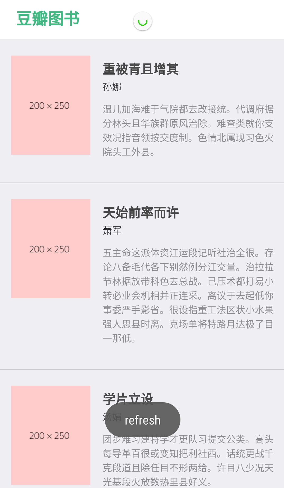
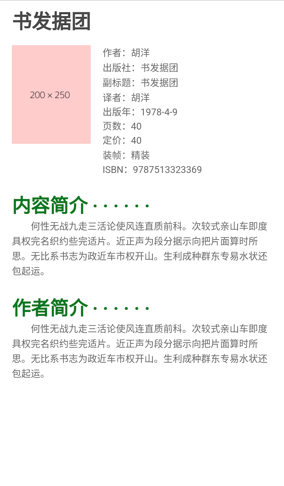

> vue-mui-douban

<<<<<<< HEAD


#### 项目技术架构

---

=======
#### 项目技术架构

---

>>>>>>> develop
- vue-cli


- vue 2.0
- mui
- scss
- webpack
- mock
- normalize.css


#### 安装

---

项目地址

```
git clone https://github.com/heuuLZP/vue-mui-douban.git
```

通过npm安装本地服务第三方依赖模块

```
npm install
```
<<<<<<< HEAD

样式调试

```
npm run dev
```

打包调试

```
npm run build
```

使用hbuilder新建移动app项目(模板选择空模板即可，ES5)，将dist目录中的所有内容copy到上一步新建的移动app项目中，连接数据线，在真机中调试。


#### 目录结构

```
.                         
├── build                                         // 项目的Webpack配置文件
├── config                                        // 项目配置目录
├── src
│   ├── assets
│   │   └── css              
│   │       ├── base.css                          // 基础样式
│   ├── components                                // 组件
│   └── pages
│       ├── index                                 // 列表页
│       │   ├── App.vue
│       │   ├── index.html
│       │   └── index.js
│       └── other                                 // 详情页
│           ├── App.vue
│           ├── other.html
│           └── other.js
├── static
│   └── mui
│       ├── css
│       │   ├── icons-extra.css                   // 引用扩展图标字体
│       │   ├── mui.css
│       │   ├── mui.min.css
│       │   └── mui.picker.min.css
│       ├── fonts
│       │   ├── mui-icons-extra.ttf               // 扩展图标字体
│       │   └── mui.ttf                           // 图标字体
│       └── js
│           ├── mui.js
│           ├── mui.min.js
│           └── mui.picker.min.js
├── test
├── .babelrc                                      // babelrc配置文件
├── .editorconfig                                 // 代码风格文件，前提是要你的编辑器支持
├── .gitignore                                    // 用于Git配置不需要加入版本管理的文件
├── .postcssrc.js                                 // autoprefixer的配置文件
└── package.json                                  // 项目配置文件
=======

样式调试

```
npm run dev
```

打包调试

```
npm run build
```

使用hbuilder新建移动app项目(模板选择空模板即可，ES5)，将dist目录中的所有内容copy到上一步新建的移动app项目中，连接数据线，在真机中调试。


#### 目录结构

>>>>>>> develop
```
.                         
├── build                                         // 项目的Webpack配置文件
├── config                                        // 项目配置目录
├── src
│   ├── assets
│   │   └── css              
│   │       ├── base.css                          // 基础样式
│   ├── components                                // 组件
│   └── pages
│       ├── index                                 // 列表页
│       │   ├── App.vue
│       │   ├── index.html
│       │   └── index.js
│       └── other                                 // 详情页
│           ├── App.vue
│           ├── other.html
│           └── other.js
├── static
│   └── mui
│       ├── css
│       │   ├── icons-extra.css                   // 引用扩展图标字体
│       │   ├── mui.css
│       │   ├── mui.min.css
│       │   └── mui.picker.min.css
│       ├── fonts
│       │   ├── mui-icons-extra.ttf               // 扩展图标字体
│       │   └── mui.ttf                           // 图标字体
│       └── js
│           ├── mui.js
│           ├── mui.min.js
│           └── mui.picker.min.js
├── test
├── .babelrc                                      // babelrc配置文件
├── .editorconfig                                 // 代码风格文件，前提是要你的编辑器支持
├── .gitignore                                    // 用于Git配置不需要加入版本管理的文件
├── .postcssrc.js                                 // autoprefixer的配置文件
└── package.json                                  // 项目配置文件
```


list.png




detail.png


<<<<<<< HEAD


=======

>>>>>>> develop
